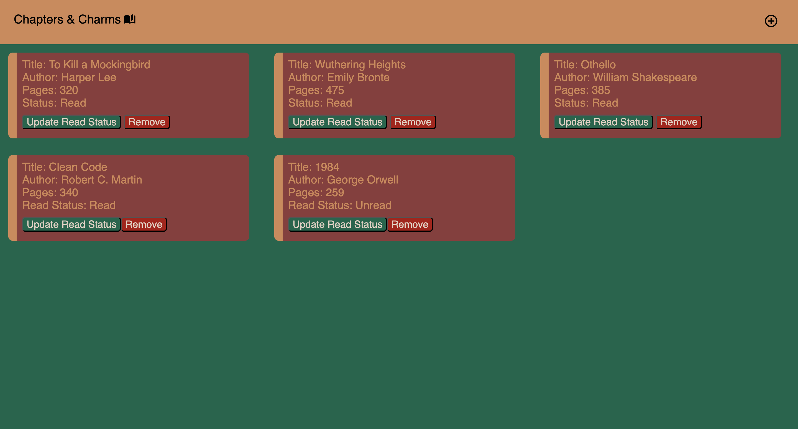
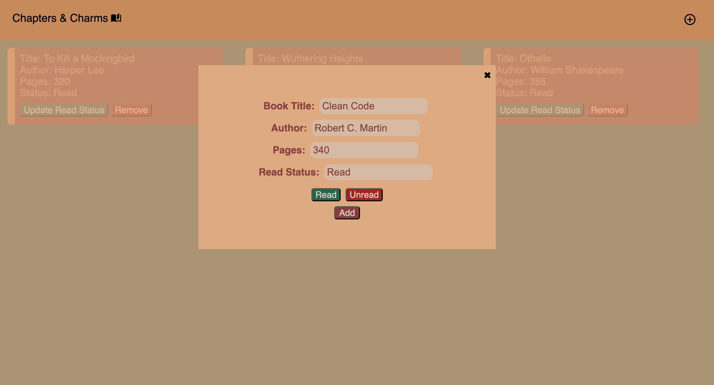

# Chapter & Charms Library

I created a Library book tracker which stores the books a user reads and stores information about the book. For example, the title, author, number of pages and the current read status of the book.

## Live Demo 

[**View the live project here**](https://aimei60.github.io/Library/)

## Technologies Used

- HTML5
- CSS3 (Flexbox & Grid)
- Javascript ES6+

## What I learned

- Learned how to dynamically manipulate the DOM to add, display, and remove books from the library.
- Practiced event handling to update the interface based on user actions.

## Preview

Here is a preview of the Library 

## Credits

Icons were sourced from Material icons